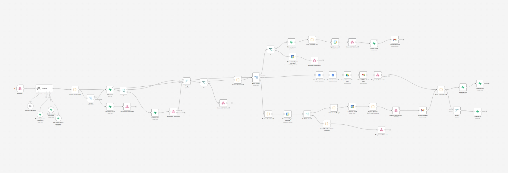
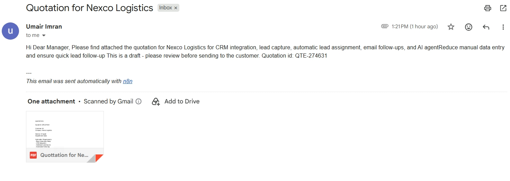
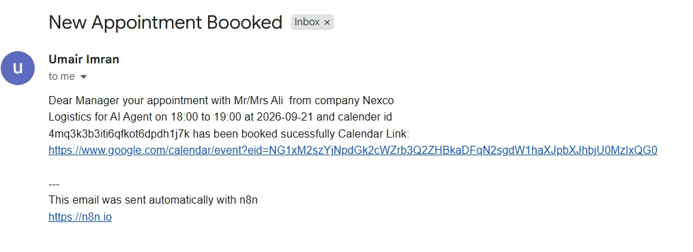
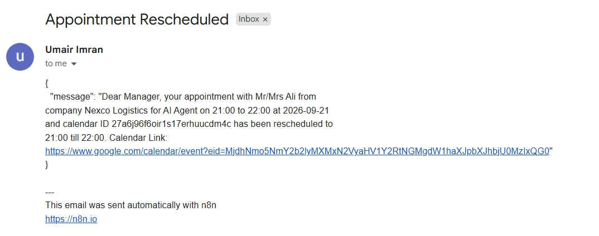
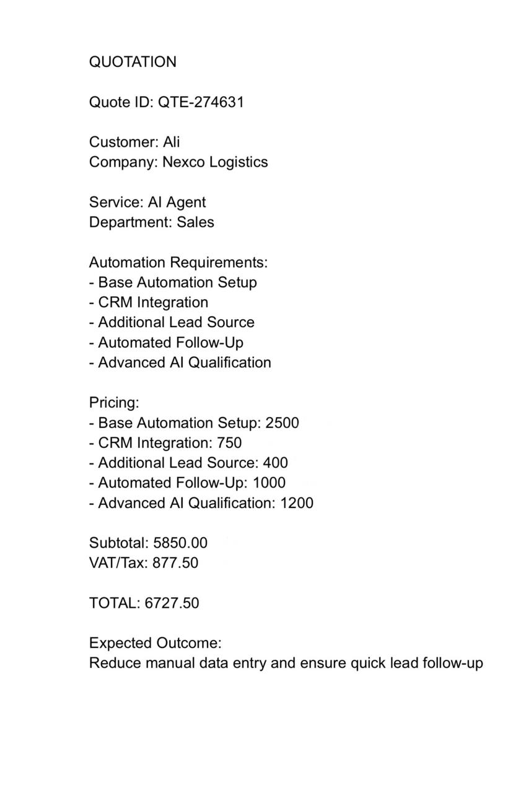

# AI-Automation-Agency-Consultant-ElevenLabs-n8n-Supabase
An end-to-end AI Automation Agency consultation system built with ElevenLabs, n8n, Supabase, Google Calendar, Gmail, and Google Drive.
The system uses an ElevenLabs conversational agent as the customer-facing layer and n8n as the automation backend. Customer requests are received through webhooks, processed by an AI Agent, validated against Supabase data, and routed to the appropriate automation workflow.

Key Capabilities
AI-powered business consultation through ElevenLabs
Customer lookup and customer record creation
Business and service information retrieval
Automation requirement discovery
AI-powered quotation generation using real Supabase requirements and pricing
Automatic quote ID generation
Subtotal, VAT/tax, and total calculation
Appointment booking with availability validation
Google Calendar event creation
Appointment rescheduling with existing appointment lookup
Calendar availability and time-slot validation
Supabase appointment and customer data management
Automated Gmail notifications
Quotation document generation and PDF export
Webhook responses back to the conversational agent
Structured JSON processing and string normalization
Error handling and validation for failed requests
Architecture

ElevenLabs Agent → n8n Webhook → AI Agent → Supabase → Action Routing → Automation Workflow → Database / Calendar / Gmail / PDF → Webhook Response

Supabase acts as the source of truth for customer information, services, automation requirements, pricing, appointments, and related business data. The AI Agent is instructed to use actual stored information rather than inventing records, availability, prices, or other business data.

Main Automation Flows

Customer Management

Check existing customer information
Create new customer records
Generate customer IDs when required
Maintain customer and business information

Quotation Automation

Identify automation requirements
Retrieve applicable components and pricing
Calculate subtotal and applicable VAT/tax
Generate a unique quotation ID
Produce a complete quotation
Generate quotation documents/PDFs
Prepare Gmail notifications

Appointment Booking

Validate requested date and time
Check calendar availability
Prevent unavailable time slots
Create Google Calendar events
Store appointment information in Supabase
Return appointment confirmation details

Appointment Rescheduling

Locate the existing appointment
Validate the requested new time
Check Google Calendar availability
Update the calendar event
Update the appointment record in Supabase
Send a rescheduling notification
Technologies Used

n8n
ElevenLabs
Supabase
OpenAI / AI Agents
Google Calendar API
Gmail
Google Drive
Webhooks
JavaScript
REST APIs
JSON
PDF Generation
Database Automation
Workflow Automation

This project demonstrates how conversational AI can be connected to a structured backend to turn natural-language business requests into real automated actions.

## Screenshots 📸

## Workflow

## Quotation Email

## New Appointment Email

## Reschedule Email

## AI Generated Quotation

